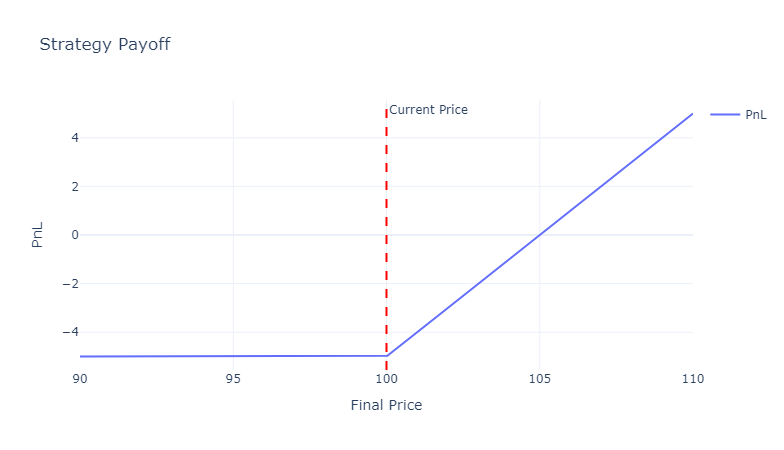
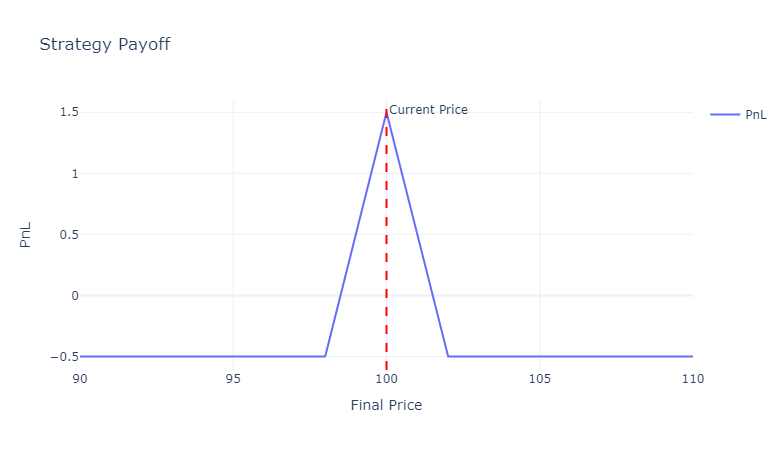
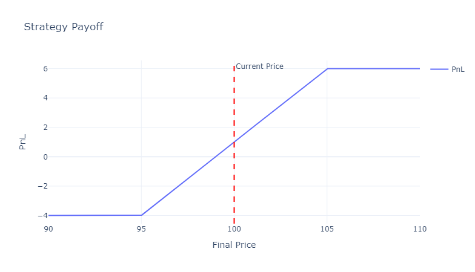
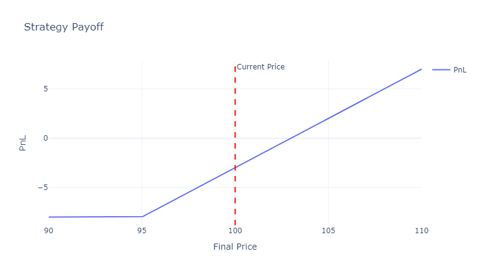
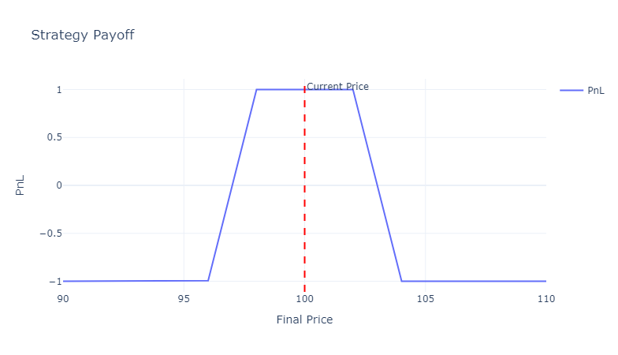

# Finalysis
A python library for financial instrument payoff analysis.

[](https://finalysis-python.streamlit.app/)

## 🚀 Quickstart

```python
from finalysis import Spot, Option, plot

current_price = 100
strategy = Spot(price=current_price) + Option(premium=5, strike=100, kind='put')
plot.payoff(strategy, current_price)
```



## 📦 Features

- Core primitives: Spot, Option, Future
- Strategy composition using +, -, * operators
- Streamlit UI to build strategies interactively (https://finalysis-python.streamlit.app/)
- Plotting payoff diagrams

## 📈 Examples

| Strategy | Code | Payoff |
| --- | --- | --- |
| Butterfly | `Option(strike=98, premium=4, kind='call') -2*Option(strike=100, premium=2.5, kind='call') + Option(strike=102, premium=1.5, kind='call')` |  |
| Bull Call | `Option(strike=95, premium=6, kind='call') - Option(strike=105, premium=2, kind='call')` |  |
| Protective Put | `Spot(price=100) + Option(strike=95, premium=3, kind='put')` |  |
| Iron Condor | `Option(strike=96, premium=1.5, kind='put') -Option(strike=98, premium=2, kind='put') -Option(strike=102, premium=2, kind='call') + Option(strike=104, premium=1.5, kind='call')` |  |
